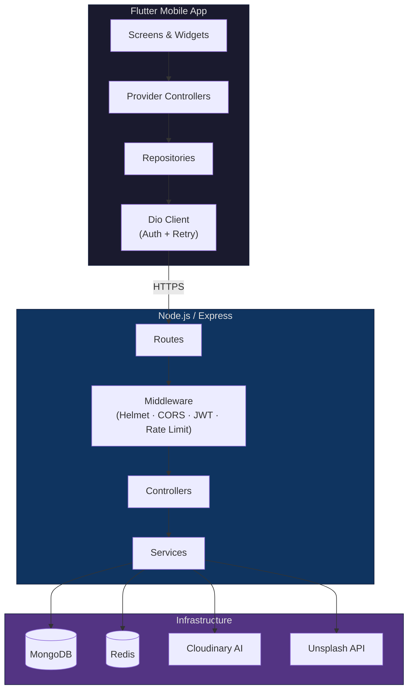
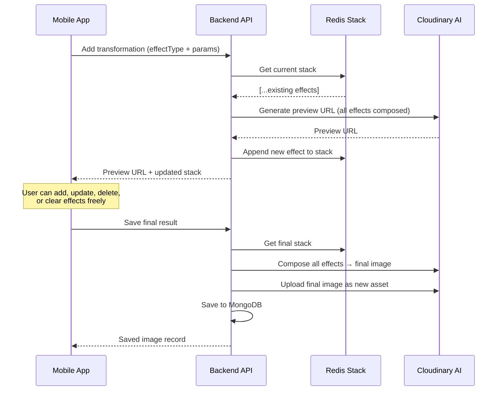

<div align="center">

# ✨ Creater.io

### AI-Powered Image Editing Platform

[](https://github.com/FaiyazUllah786/creater.io/actions/workflows/backend-ci.yml)
[](https://github.com/FaiyazUllah786/creater.io/actions/workflows/frontend-ci.yml)


**A full-stack platform for AI-powered, non-destructive image editing — powered by Cloudinary AI, built with Node.js and Flutter.**

[Architecture](#architecture) · [Features](#features) · [Quick Start](#quick-start) · [API Reference](docs/API.md) · [Contributing](CONTRIBUTING.md)

</div>

---

## What is Creater.io?

Creater.io is an AI image editing platform that lets users upload images and apply powerful AI transformations — background replacement, object removal, generative recoloring, upscaling, and more — through an intuitive mobile interface.

Transformations are **non-destructive and stackable**: users build a pipeline of effects, preview the result in real-time, and only commit when satisfied. The transformation stack is managed in Redis, and the actual AI processing is handled by Cloudinary's ML pipeline.

---

## Features

### 🎨 AI Transformations (10 Effects)

| Effect | Description |
|--------|-------------|
| **Generative Background Fill** | AI-extends the canvas with generated content |
| **Background Replace** | Replaces the entire background using a text prompt |
| **AI Enhance** | Automatic quality and detail enhancement |
| **Object Replace** | Swaps a specified object for another via prompt |
| **Object Remove** | Removes objects described by natural language |
| **Background Removal** | Cleanly removes the image background |
| **Generative Recolor** | Recolors specified objects to a target color |
| **Generative Restore** | Restores degraded or old photos |
| **Generative Upscale** | AI-powered resolution upscaling |
| **Content Extraction** | Extracts specific objects from images |

### 📱 Platform Features

- **Cross-platform** — Android, iOS, and Web (Flutter)
- **OAuth** — Sign in with Google or GitHub (web + native mobile)
- **Image Gallery** — Paginated, staggered grid with cached thumbnails
- **Unsplash Integration** — Search and import stock photos
- **Dark/Light Theme** — System-aware with manual override
- **Firebase** — Crashlytics and Analytics integration
- **Security** — Helmet, Redis-backed rate limiting, JWT with refresh rotation

---

## Architecture



### AI Transformation Pipeline

The core editing flow uses a **non-destructive, Redis-backed transformation stack**:



📖 **Full architecture documentation**: [docs/ARCHITECTURE.md](docs/ARCHITECTURE.md)

---

## Tech Stack

| Layer | Technology | Purpose |
|-------|-----------|---------|
| **Frontend** | Flutter 3.41+ (Dart) | Cross-platform mobile app |
| **State** | Provider + ChangeNotifier | Reactive state management |
| **Networking** | Dio | HTTP client with interceptors |
| **Backend** | Node.js + Express | REST API server |
| **Database** | MongoDB (Mongoose) | Primary data storage |
| **Cache** | Redis (ioredis) | Transformation stack, API cache, rate limiting |
| **Image AI** | Cloudinary | AI transformations, image storage |
| **Auth** | JWT + Passport.js | Access/refresh token auth, OAuth |
| **OAuth** | Google, GitHub | Third-party authentication |
| **Stock Photos** | Unsplash API | Stock photo search and import |
| **Observability** | Firebase Crashlytics + Analytics | Crash reporting, usage tracking |
| **Testing** | Vitest, Supertest, Flutter Test | Unit and integration testing |
| **CI/CD** | GitHub Actions | Automated testing on push/PR |

---

## Folder Structure

```
creater.io/
├── backend/                       ← Node.js/Express REST API
│   ├── src/
│   │   ├── controllers/           ← Request handlers
│   │   ├── middlewares/           ← Auth, rate limiting, uploads, errors
│   │   ├── models/                ← Mongoose schemas (User, Image)
│   │   ├── routes/                ← Route definitions
│   │   ├── services/              ← Cloudinary, Redis, Unsplash
│   │   ├── utils/                 ← ApiError, ApiResponse, helpers
│   │   ├── redis/                 ← Redis connection management
│   │   ├── passport/              ← OAuth strategy configuration
│   │   └── db/                    ← MongoDB connection
│   ├── package.json
│   └── ENV.txt                    ← Environment variable template
│
├── frontend/
│   └── flutter/                   ← Flutter mobile app
│       ├── lib/
│       │   ├── features/          ← Feature modules (auth, image)
│       │   ├── core/              ← Config, networking, services
│       │   ├── common/            ← Shared widgets, theme, utils
│       │   └── model/             ← Data models
│       ├── pubspec.yaml
│       └── docs/DEVELOPMENT.md    ← Flutter build guide
│
├── docs/                          ← Project documentation
│   ├── ARCHITECTURE.md            ← System architecture
│   ├── API.md                     ← API endpoint reference
│   ├── SECURITY.md                ← Security overview
│   ├── DEPLOYMENT.md              ← Deployment guide
│   ├── images/                    ← Diagrams and screenshots
│   └── archive/                   ← Historical audit reports
│
├── .github/workflows/             ← CI/CD pipelines
├── CONTRIBUTING.md                ← Contribution guidelines
└── README.md                      ← This file
```

---

## Quick Start

### Prerequisites

- **Node.js** 18+ and **npm** 9+
- **Flutter** 3.41+ (stable)
- **MongoDB** 6.0+ (local or [Atlas](https://www.mongodb.com/atlas))
- **Redis** 7.0+ (local or [Upstash](https://upstash.com/))
- **Cloudinary** account ([free tier](https://cloudinary.com/pricing))

### 1. Clone

```bash
git clone https://github.com/FaiyazUllah786/creater.io.git
cd creater.io
```

### 2. Backend

```bash
cd backend
npm install

# Configure environment
cp ENV.txt .env
# Edit .env with your MongoDB, Redis, Cloudinary, and OAuth credentials

# Start development server
npm run dev
```

Verify: `curl http://localhost:5000/health` → `{"status":"ok"}`

### 3. Flutter App

```bash
cd frontend/flutter
flutter pub get

# Create config (do NOT commit)
mkdir -p config
# Create config/dev.json — see frontend/flutter/ENV.txt for required variables

# Run on device/emulator
flutter run --dart-define-from-file=config/dev.json
```

📖 See [docs/DEPLOYMENT.md](docs/DEPLOYMENT.md) for staging, production, and release instructions.

---

## Environment Configuration

### Backend (`.env`)

| Variable | Required | Description |
|----------|----------|-------------|
| `PORT` | ✅ | Server port |
| `NODE_ENV` | ✅ | `development` / `production` |
| `MONGODB_URI` | ✅ | MongoDB connection string |
| `REDIS_URL` | ✅ | Redis connection URL |
| `ACCESS_TOKEN_SECRET` | ✅ | JWT secret (min 32 chars) |
| `REFRESH_TOKEN_SECRET` | ✅ | JWT secret (min 32 chars) |
| `ACCESS_TOKEN_EXPIRY` | ✅ | e.g., `1h` |
| `REFRESH_TOKEN_EXPIRY` | ✅ | e.g., `30d` |
| `FRONTEND_URL` | ✅ | Frontend URL for CORS/redirects |
| `CLOUD_NAME`, `API_KEY`, `API_SECRET` | ✅* | Cloudinary credentials |

*Required for image features. See [`backend/ENV.txt`](backend/ENV.txt) for the complete list.

### Flutter (`config/dev.json`)

```json
{
  "SERVER_URL": "http://localhost:5000",
  "UNSPLASH_ACCESS_KEY": "your-key",
  "UNSPLASH_SECRET_KEY": "your-secret",
  "GITHUB_CLIENT_ID": "your-client-id"
}
```

---

## API Overview

| Route Group | Endpoints | Auth | Description |
|-------------|-----------|------|-------------|
| `GET /health` | 1 | — | MongoDB + Redis health check |
| `/user/auth/*` | 4 | Mixed | Register, login, logout, refresh |
| `/user/*` | 4 | 🔒 | Profile CRUD, password, photo |
| `/auth/*` | 6 | — | OAuth (Google/GitHub, web + mobile) |
| `/image/*` | 9 | 🔒 | Upload, gallery, transformations |
| `/unsplash/*` | 2 | 🔒 | Stock photo search and download |

📖 **Full API reference**: [docs/API.md](docs/API.md)

---

## Security

- **Helmet** HTTP security headers
- **Redis-backed rate limiting** — 4 tiers (auth, refresh, cloudinary, general)
- **JWT** access/refresh tokens with rotation and reuse detection
- **bcrypt** password hashing (10 rounds)
- **httpOnly/secure cookies** with SameSite protection
- **Multer** file type and size validation
- **Startup env validation** — blocks insecure/missing configuration
- **Input sanitization** on all transformation prompts

📖 **Full security documentation**: [docs/SECURITY.md](docs/SECURITY.md)

---

## Testing

```bash
# Backend (Vitest)
cd backend && npm test

# Frontend (Flutter)
cd frontend/flutter && flutter test
```

Backend test coverage includes auth flows, image controllers, OAuth collision handling, Redis failure scenarios, JWT verification, rate limiting, and environment validation.

---

## Contributing

We welcome contributions! Please read the [Contributing Guide](CONTRIBUTING.md) for:

- Development setup
- Branch naming and commit conventions
- Pull request process
- Code style requirements
- Testing expectations

---

## Documentation

| Document | Description |
|----------|-------------|
| [Architecture](docs/ARCHITECTURE.md) | System design, data flow, AI pipeline |
| [API Reference](docs/API.md) | Complete endpoint documentation |
| [Security](docs/SECURITY.md) | Security implementations |
| [Deployment](docs/DEPLOYMENT.md) | Local, staging, production, rollback |
| [Contributing](CONTRIBUTING.md) | How to contribute |
| [Backend README](backend/README.md) | Backend setup and reference |
| [Flutter README](frontend/flutter/README.md) | Frontend setup and architecture |
| [Flutter Development](frontend/flutter/docs/DEVELOPMENT.md) | Build configuration and VS Code setup |

---

## Roadmap

- [ ] Video transformation support
- [ ] Batch image processing
- [ ] Collaborative editing
- [ ] Image annotation tools
- [ ] Custom transformation presets
- [ ] Export to multiple formats
- [ ] Desktop app support

---

## License

**TBD** — License has not yet been determined. See this repository for updates.

---

## Credits

Built by [@FaiyazUllah786](https://github.com/FaiyazUllah786)

Powered by:
- [Cloudinary](https://cloudinary.com/) — AI image transformations
- [Unsplash](https://unsplash.com/) — Stock photography
- [Express](https://expressjs.com/) — Backend framework
- [Flutter](https://flutter.dev/) — Frontend framework
- [MongoDB](https://www.mongodb.com/) — Database
- [Redis](https://redis.io/) — In-memory data store
