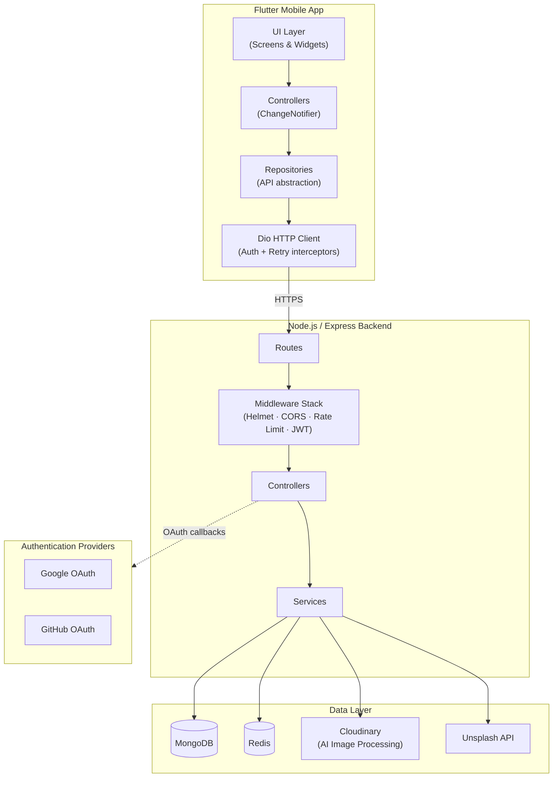
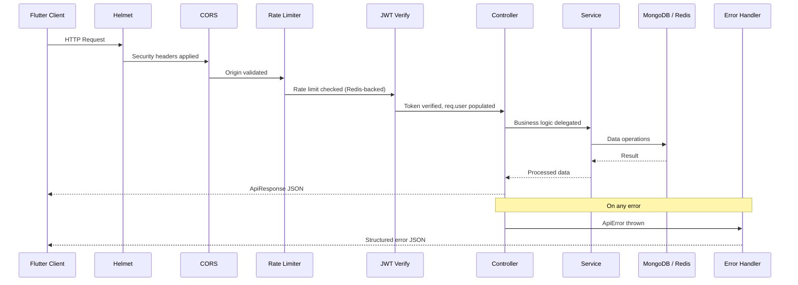
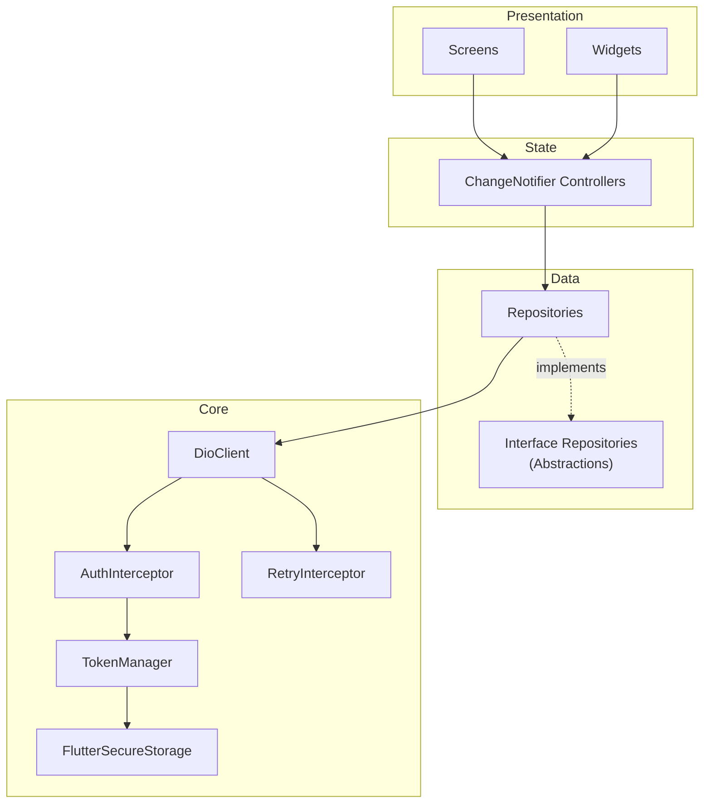
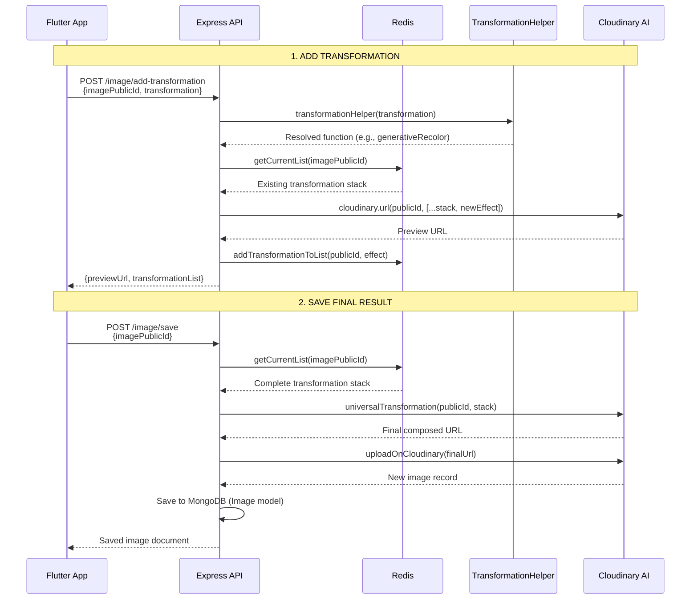
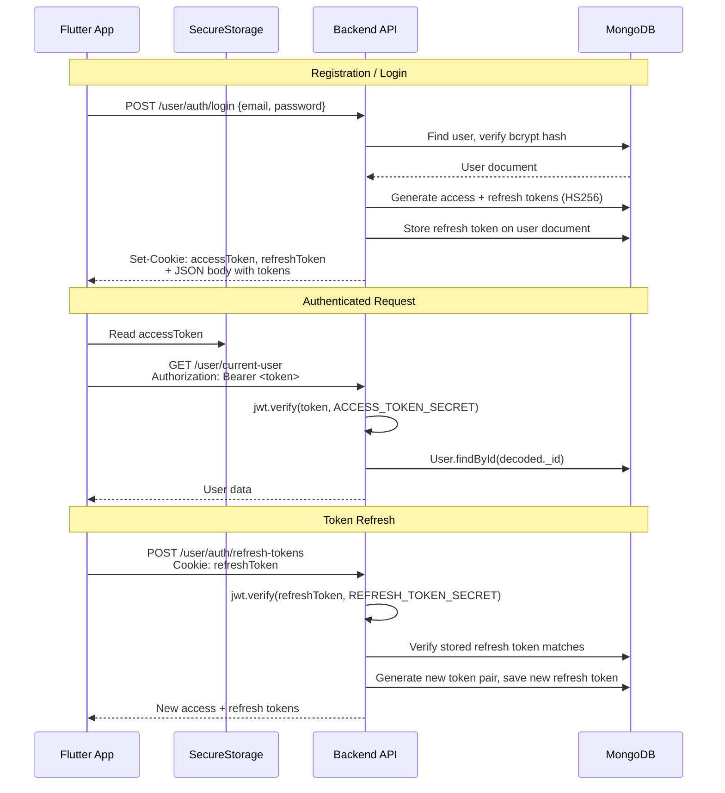
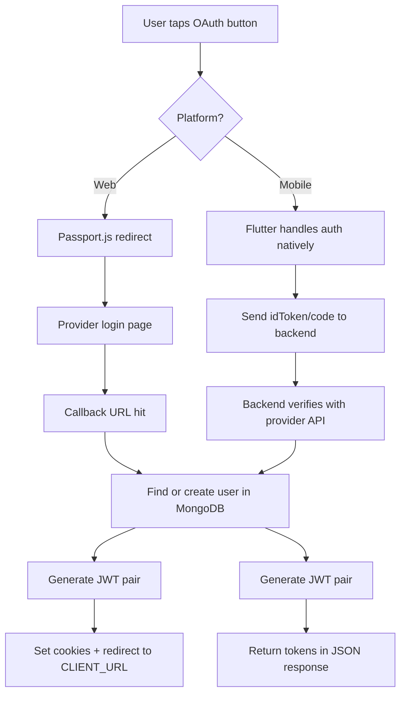

# Creater.io — Architecture

> A technical overview of the system design, data flow, and key subsystems.

---

## System Architecture



---

## Request Lifecycle

Every HTTP request flows through a consistent middleware chain before reaching business logic:



---

## Backend Architecture

### Layer Breakdown

| Layer | Location | Responsibility |
|-------|----------|----------------|
| **Entry** | `src/index.js` | Env validation → MongoDB → Redis → HTTP listen |
| **App** | `src/app.js` | Express setup: Helmet, CORS, cookie-parser, Morgan, routes, 404 handler, global error handler |
| **Routes** | `src/routes/` | HTTP method + path → middleware chain → controller |
| **Middleware** | `src/middlewares/` | JWT verification, rate limiting, file uploads (Multer), error handling |
| **Controllers** | `src/controllers/` | Request validation, orchestrate services, format response |
| **Services** | `src/services/` | External integrations (Cloudinary, Unsplash, Redis transformation CRUD) |
| **Models** | `src/models/` | Mongoose schemas with business methods (bcrypt, JWT generation) |
| **Utils** | `src/utils/` | ApiError, ApiResponse, asyncHandler, cookie config, env validation |

### Route Mounting

```
Express App
├── /user/*     → User routes (auth, profile CRUD)
├── /image/*    → Image routes (upload, gallery, transformations)
├── /auth/*     → OAuth routes (GitHub/Google web + mobile)
├── /unsplash/* → Unsplash proxy (search, download tracking)
└── /health     → Health check (MongoDB + Redis status)
```

---

## Frontend Architecture

The Flutter app uses a **feature-first** directory structure with **Provider** for state management and a **Repository** pattern for data access.

### Layer Diagram



### Feature Structure

Each feature follows a consistent pattern:

```
features/<feature>/
├── controller/     — ChangeNotifier classes (business logic + state)
├── repository/     — API communication (interface + implementation)
├── screens/        — Full-page widgets
└── widgets/        — Feature-specific reusable widgets
```

**Current features:**
- **`auth`** — Login, signup, profile management, password update, OAuth
- **`image`** — Image gallery, image editor, AI transformations

### State Management

- **Provider** + **ChangeNotifier** for reactive state
- Controllers are registered in `main.dart` via `MultiProvider`
- Active providers: `AuthController`, `ProfileController`, `UnsplashProvider`, `ImageController`, `ThemeProvider`

---

## AI Transformation Pipeline

> This is the core value proposition of Creater.io — a non-destructive, stackable AI image editing pipeline powered by Cloudinary's AI capabilities.

### Supported Transformations

| Effect Type | Function | Description |
|-------------|----------|-------------|
| `gen_fill` | Generative Background Fill | AI-extends image canvas with generated content |
| `gen_background_replace` | Background Replace | Replaces entire background using a text prompt |
| `enhance` | AI Image Enhancer | Automatic quality enhancement |
| `gen_replace` | Object Replace | Replaces a specified object with another via prompt |
| `gen_remove` | Object Remove | Removes objects described by prompt |
| `background_removal` | Background Removal | Removes image background entirely |
| `gen_recolor` | Generative Recolor | Recolors specified objects to a target color |
| `gen_restore` | Generative Restore | Restores degraded/old photos |
| `upscale` | Generative Upscale | AI-powered resolution upscaling |
| `extract` | Content Extraction | Extracts specific objects from images |

### Pipeline Architecture



### How It Works

1. **Non-destructive editing**: Transformations are stored as a stack in Redis (keyed by `transformation:<publicId>`), not applied permanently until the user saves.

2. **Stack composition**: Each transformation function retrieves the current stack from Redis, appends its effect, and generates a preview URL by passing the full stack to Cloudinary's URL builder.

3. **Effect dispatching**: The `transformationHelper` maps an `effectType` string to the correct transformation function via a switch statement.

4. **Input sanitization**: All user-provided prompts are sanitized to strip `;`, `,`, `/`, and `\` characters before being embedded into Cloudinary effect strings.

5. **TTL management**: Transformation stacks expire after 2 hours (`TTL_SECONDS = 7200`). The TTL is refreshed on every read to prevent expiration during active editing sessions.

6. **CRUD operations**: The stack supports add, update (by transformation ID), delete (by ID), and clear (delete all). Each operation persists the updated stack back to Redis.

7. **Final save**: When the user commits, the full stack is composed into a single Cloudinary URL, the result is re-uploaded as a new Cloudinary image, and a new `Image` document is created in MongoDB.

---

## Authentication Flow

### JWT Token Lifecycle



### OAuth Flow (Google / GitHub)



**Web flow**: Uses Passport.js strategies (`passport-github2`, `passport-google-oauth20`) with cookie-based token delivery.

**Mobile flow**: Flutter performs OAuth natively, then sends the resulting `idToken` (Google) or authorization `code` (GitHub) to dedicated `/auth/*/mobile` endpoints. The backend verifies directly with the provider's API and returns tokens in the JSON response body.

---

## Database Design

### User Model

```
User {
  _id:           ObjectId (auto)
  userName:      String   (required, unique, lowercase, indexed)
  email:         String   (required, unique)
  password:      String   (required, bcrypt-hashed on save)
  authProvider:  String   (default: "local" | "github" | "google")
  githubId:      String   (optional)
  googleId:      String   (optional)
  profilePhoto:  String   (optional, Cloudinary URL)
  firstName:     String   (optional)
  lastName:      String   (optional)
  refreshToken:  String   (current valid refresh token)
  createdAt:     Date     (auto, timestamps plugin)
  updatedAt:     Date     (auto, timestamps plugin)
}
```

### Image Model

```
Image {
  _id:        ObjectId (auto)
  publicId:   String   (required, Cloudinary public ID)
  secureUrl:  String   (required, Cloudinary HTTPS URL)
  height:     Number   (required)
  width:      Number   (required)
  author:     ObjectId (required, ref: User)
  createdAt:  Date     (default: Date.now)
}
```

**Relationships**: `Image.author` → `User._id` (one-to-many). The `mongoose-aggregate-paginate-v2` plugin enables cursor-based pagination on image queries.

---

## Redis Usage

Redis serves three distinct purposes in Creater.io:

| Purpose | Key Pattern | TTL | Description |
|---------|-------------|-----|-------------|
| **Transformation Stack** | `transformation:<publicId>` | 2 hours (refreshed on read) | Stores the ordered list of AI effects being composed on an image |
| **Unsplash Cache** | `unsplash:search:<query>:<page>:<perPage>:<orientation>` | 1 hour | Caches Unsplash API responses to conserve API quota |
| **Rate Limiting** | Managed by `rate-limit-redis` | Varies by limiter | Stores request counters for the 4 rate limiting tiers |

---

## Cloudinary Integration

Cloudinary is used for:

1. **Image storage** — All user-uploaded images and profile photos are stored on Cloudinary with the `creater.io` upload preset
2. **AI transformations** — The 10 transformation functions generate Cloudinary transformation URLs that are processed server-side
3. **URL generation** — `cloudinary.url()` composes transformation chains into a single URL for preview
4. **Cleanup** — Images are deleted from Cloudinary when a user deletes an image or their account

Allowed upload formats: `jpg`, `png`, `webp`, `jpeg`
