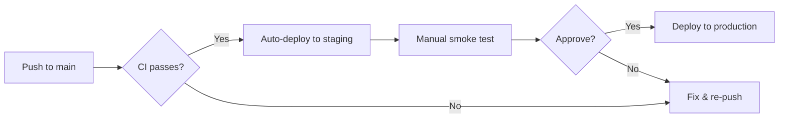

# Creater.io — Deployment Guide

> Covers local development, staging, production, secrets management, release process, and rollback procedures.

---

## Prerequisites

| Dependency | Version | Purpose |
|-----------|---------|---------|
| **Node.js** | 18.x or 20.x | Backend runtime |
| **npm** | 9+ | Backend package management |
| **Flutter** | 3.41.3+ (stable) | Mobile frontend |
| **MongoDB** | 6.0+ | Primary database |
| **Redis** | 7.0+ | Transformation stack, caching, rate limiting |
| **Cloudinary** | — | Image storage and AI transformations (account required) |

Optional:
- **GitHub OAuth App** — For GitHub login
- **Google Cloud Project** — For Google login (web + Android client IDs)
- **Unsplash Developer Account** — For stock photo integration
- **Firebase Project** — For analytics and crashlytics (Flutter)

---

## Local Development

### Backend

```bash
# 1. Navigate to backend
cd backend

# 2. Install dependencies
npm install

# 3. Create .env from template
cp ENV.txt .env
# Edit .env with your local values

# 4. Ensure MongoDB is running locally (or use Atlas)
# 5. Ensure Redis is running locally (or use a cloud provider)

# 6. Start development server (with hot reload)
npm run dev
```

The server starts on the port specified in `.env` (default: `5000`).

**Verify**: `curl http://localhost:5000/health` should return `{"status":"ok","mongodb":true,"redis":true}`.

### Flutter Frontend

```bash
# 1. Navigate to Flutter project
cd frontend/flutter

# 2. Install dependencies
flutter pub get

# 3. Create config file (do NOT commit)
mkdir -p config
cat > config/dev.json <<EOF
{
  "SERVER_URL": "http://localhost:5000",
  "UNSPLASH_ACCESS_KEY": "your-key",
  "UNSPLASH_SECRET_KEY": "your-secret",
  "GITHUB_CLIENT_ID": "your-client-id"
}
EOF

# 4. Run on connected device/emulator
flutter run --dart-define-from-file=config/dev.json
```

See [DEVELOPMENT.md](../frontend/flutter/docs/DEVELOPMENT.md) for VS Code integration and additional configuration.

---

## Staging

Staging should mirror production as closely as possible but with test data.

### Recommended Setup

1. **Backend**: Deploy to a platform like Render, Railway, or Fly.io using the same Docker/Node setup as production.
2. **MongoDB**: Use a separate MongoDB Atlas cluster or database name for staging.
3. **Redis**: Use a separate Redis instance (e.g., Upstash, Redis Cloud free tier).
4. **Cloudinary**: Use the same account but consider a separate upload preset.

### Staging Environment Variables

Use the same variables as production but with staging-specific values:

```env
NODE_ENV=production
PORT=5000
FRONTEND_URL=https://staging.your-domain.com
CLIENT_URL=https://staging.your-domain.com
MONGODB_URI=mongodb+srv://...(staging cluster)
REDIS_URL=redis://...(staging instance)
```

### Flutter Staging Build

```bash
flutter run --dart-define-from-file=config/staging.json
```

---

## Production

### Backend Deployment

#### Option A: Render

1. Connect the GitHub repo to Render
2. Set **Root Directory** to `backend`
3. Set **Build Command**: `npm install`
4. Set **Start Command**: `npm start`
5. Set **Node Version**: `20`
6. Add all environment variables from [ENV.txt](../backend/ENV.txt) in the Render dashboard
7. The health check endpoint `/health` can be used as the health check path

#### Option B: Railway

1. Create a new project from the GitHub repo
2. Set the root directory to `backend`
3. Configure environment variables in the dashboard
4. Railway auto-detects the `npm start` script

#### Option C: Generic VPS / Docker

```bash
# On the server
cd backend
npm ci --production
NODE_ENV=production node src/index.js
```

For process management, use PM2:

```bash
npm install -g pm2
pm2 start src/index.js --name creater-io-api
pm2 save
pm2 startup
```

### Flutter Production Build

**Android APK:**
```bash
flutter build apk --dart-define-from-file=config/prod.json
```

**Android App Bundle (Play Store):**
```bash
flutter build appbundle --dart-define-from-file=config/prod.json
```

**iOS:**
```bash
flutter build ios --dart-define-from-file=config/prod.json
```

---

## Required Secrets

### Backend Secrets (Server-Side Only)

These must **never** be exposed to the client:

| Secret | Where to Obtain | Security Level |
|--------|----------------|----------------|
| `ACCESS_TOKEN_SECRET` | Generate: `openssl rand -hex 32` | 🔴 Critical — token signing |
| `REFRESH_TOKEN_SECRET` | Generate: `openssl rand -hex 32` | 🔴 Critical — token signing |
| `MONGODB_URI` | MongoDB Atlas dashboard | 🔴 Critical — database access |
| `REDIS_URL` | Redis provider dashboard | 🟡 High — caching + rate limiting |
| `API_SECRET` (Cloudinary) | Cloudinary dashboard → Settings → Access Keys | 🔴 Critical — upload/delete capability |
| `API_KEY` (Cloudinary) | Cloudinary dashboard → Settings → Access Keys | 🟡 High |
| `GITHUB_CLIENT_SECRET` | GitHub → Developer Settings → OAuth Apps | 🔴 Critical |
| `GOOGLE_CLIENT_SECRET` | Google Cloud Console → Credentials | 🔴 Critical |
| `GITHUB_ANDROID_CLIENT_SECRET` | GitHub → Developer Settings → OAuth Apps | 🔴 Critical |

### Client-Side Configuration (Flutter)

These are embedded at compile time and are public-facing:

| Variable | Where to Obtain | Security Level |
|----------|----------------|----------------|
| `SERVER_URL` | Your deployed backend URL | 🟢 Public |
| `UNSPLASH_ACCESS_KEY` | Unsplash → Developer → Your App | 🟢 Public (rate-limited) |
| `UNSPLASH_SECRET_KEY` | Unsplash → Developer → Your App | 🟡 Semi-public |
| `GITHUB_CLIENT_ID` | GitHub → Developer Settings → OAuth Apps | 🟢 Public |

### Secret Generation

```bash
# Generate secure token secrets
openssl rand -hex 32
# Example output: a3f8c2d91e7b4a6f5c8d3e2a1b9f7e4d6c5a8b3d2e1f9a7c6b5d4e3f2a1b8c
```

---

## CI/CD

### Existing GitHub Actions

The project has two CI workflows:

#### Backend CI (`.github/workflows/backend-ci.yml`)

- **Triggers**: Push/PR to `main` affecting `backend/**`
- **Matrix**: Node.js 18.x and 20.x
- **Steps**: `npm ci` → `npm run test` (Vitest)

#### Frontend CI (`.github/workflows/frontend-ci.yml`)

- **Triggers**: Push/PR to `main` affecting `frontend/flutter/**`
- **Flutter version**: 3.41.3 (stable)
- **Steps**: `flutter pub get` → `dart format --set-exit-if-changed .` → `flutter analyze` → `flutter test`

### Deployment Workflow

Currently, deployment is manual. A recommended CD pipeline:



---

## Release Process

### Backend Release

1. **Ensure CI is green** on the target branch
2. **Test locally** with production-like environment variables
3. **Tag the release**: `git tag -a v1.x.x -m "Release v1.x.x"`
4. **Push the tag**: `git push origin v1.x.x`
5. **Deploy** via your platform's deployment mechanism (Render auto-deploys from `main`, or trigger manually)
6. **Verify health**: `curl https://your-api.com/health`
7. **Monitor logs** for the first 15 minutes after deployment

### Flutter Release

1. **Update version** in `pubspec.yaml` (`version: x.y.z+buildNumber`)
2. **Build release artifacts**: `flutter build appbundle --dart-define-from-file=config/prod.json`
3. **Test on a physical device** before submitting
4. **Upload to Play Store / App Store Connect**
5. **Create GitHub release** with the tag and changelog

---

## Rollback

### Backend Rollback

#### Render / Railway

- Use the platform's **deploy history** to redeploy a previous commit
- Render: Dashboard → Manual Deploy → select previous commit
- Railway: Dashboard → Deployments → redeploy previous

#### Manual Rollback

```bash
# 1. Identify the last working commit
git log --oneline -10

# 2. Revert to that commit
git revert <commit-hash>
git push origin main

# Or force deploy a specific tag
git checkout v1.x.x
# Redeploy from this state
```

#### Database Rollback

- MongoDB Atlas provides **point-in-time recovery** for M10+ clusters
- For smaller clusters, maintain regular `mongodump` backups
- Redis data is ephemeral (transformation stacks, cache) — no rollback needed

### Flutter Rollback

- **Play Store**: Use the Play Console to halt the rollout and revert to the previous version
- **App Store**: Contact Apple support or submit a new build with the previous version's code

### Emergency Procedures

1. **API is down**: Check `/health` endpoint → verify MongoDB and Redis connectivity → check environment variables → review recent deployments
2. **Auth is broken**: Verify `ACCESS_TOKEN_SECRET` and `REFRESH_TOKEN_SECRET` haven't changed — rotating these invalidates all existing tokens
3. **Cloudinary is failing**: Check Cloudinary status page → verify `CLOUD_NAME`, `API_KEY`, `API_SECRET` → check rate limits
4. **Redis is down**: The app continues to function in degraded mode — image transformations will fail but auth and CRUD operations continue

---

## Monitoring

### Health Check

```bash
# Quick health check
curl -s https://your-api.com/health | jq

# Expected: {"status":"ok","mongodb":true,"redis":true}
# Degraded: {"status":"degraded","mongodb":true,"redis":false}
# Down:     {"status":"error","mongodb":false,"redis":false}
```

### Logging

- **Development**: Morgan `dev` format logs all requests to stdout
- **Production**: Morgan logs should be piped to a log aggregation service
- **Firebase Crashlytics**: Flutter app automatically reports crashes and non-fatal errors
- **Firebase Analytics**: Tracks screen views and custom events via `AnalyticsService`
